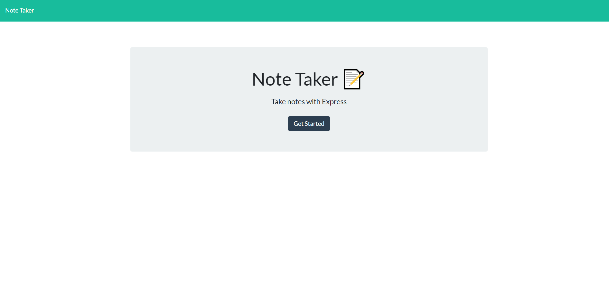

# Note Taker

# Description:

It's a web application that allows a user to make and delete notes that are saved to the server.

# Table of Contents:

- [Usage](#usage)
- [License](#license)
- [Contact me](#contact-me)

# Usage:

Head to [here](https://note-taker-web-applic.herokuapp.com/) and click on "Get Started". For each note there must be a title and text for each note before you can save a note.

# License:

This project is licensed under the MIT license, which you can read about [here](https://opensource.org/licenses/MIT).

# Contact me:

Contact me using my [GitHub](https://github.com/Justinean) or my email: justinonlycoding@gmail.com
